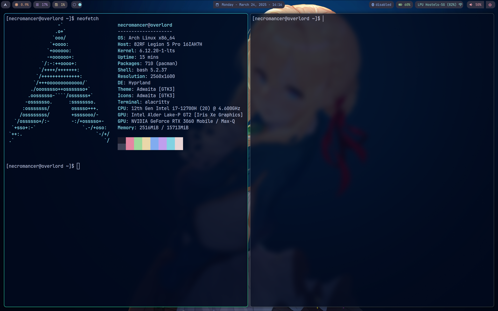

# Dotfiles 2025

## My New Hyprland Dotfiles

### Essential Packages:
```bash
sudo pacman -S rofi dolhpin hyprshade firefox alacritty waybar nvidia nvidia-utils brightnessctl pipewire wireplumber pipewire-pulse pipewire-alsa pipewire-jack kservice5 archlinux-xdg-menu neofetch fastfetch unzip man bash-completion wl-clipboard bluez bluez-utils blueman blueman-manager zsh
```
```bash
sudo pacman -S --needed git base-devel && git clone https://aur.archlinux.org/yay.git && cd yay && makepkg -si
```
```bash
yay -S cloudflare-warp-bin fira-code hyprshot visual-studio-code-bin ttf-jetbrains-mono ttf-nerd-fonts-symbols ttf-jetbrains-mono-nerd waypaper hyprpaper hyprshade 
```

### Wallpapers: https://github.com/Asthetic/AnimeBackgrounds




### so i dont forgot
systemctl --user enable pipewire pipewire-pulse wireplumber
systemctl --user start pipewire pipewire-pulse wireplumber

sudo systemctl enable warp-svc
killall -SIGUSR2 waybar

